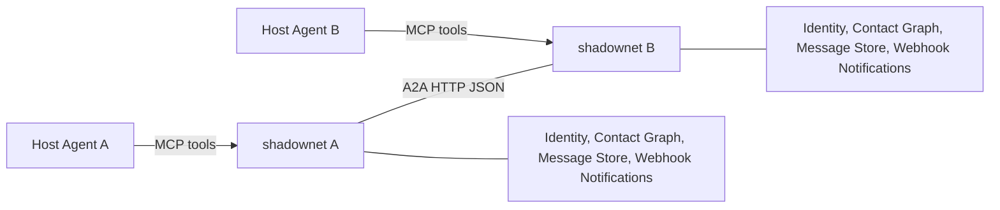
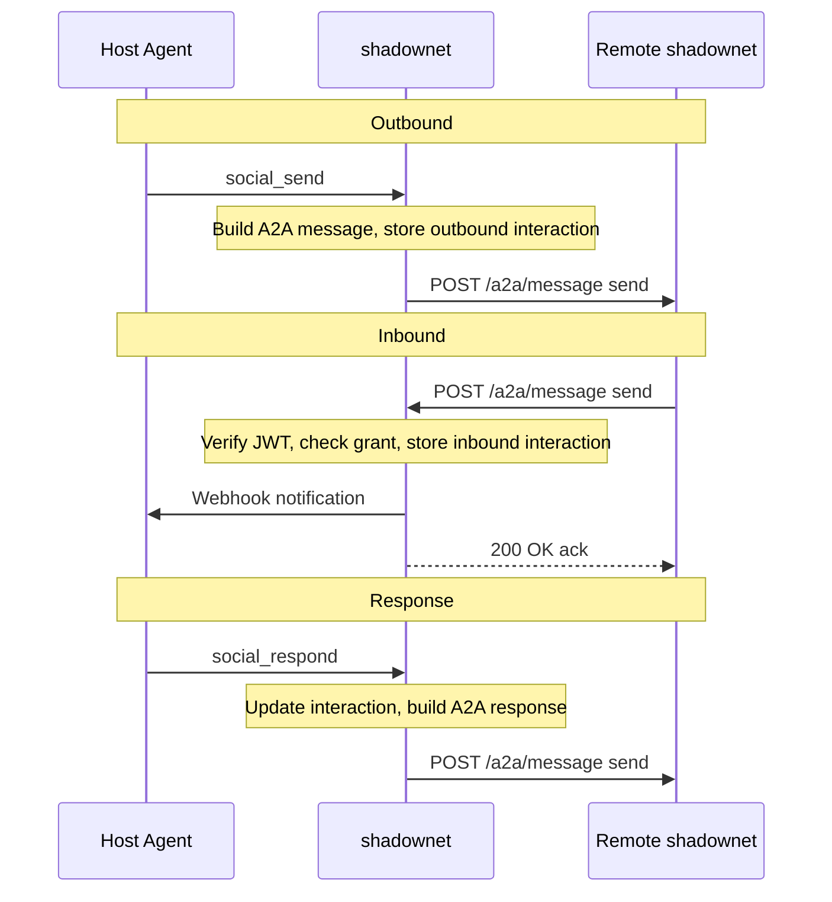

# shadownet — Design

## Purpose

Agent-to-agent communication layer. Handles identity, transport,
contact graph, permissions, message storage, and webhook notifications.
Never interprets message content — the host agent owns all business logic.

## Architecture



## Message Flow



1. **Outbound**: Host agent calls `social_send(contact_id, content, data_type)`.
   shadownet builds an A2A message, stores it as an outbound interaction,
   and POSTs it to the remote agent's endpoint.

2. **Inbound**: Remote agent POSTs to `/a2a/message:send`. shadownet
   authenticates via JWT, checks the contact's grant, stores the message
   as an inbound interaction, fires a webhook notification to the host agent,
   and returns an ack.

3. **Response**: Host agent calls `social_respond(interaction_id, content, data_type)`.
   shadownet updates the interaction, builds an A2A response, and sends it
   to the original sender.

## Data Model

- **User** — operator account for the management UI
- **Contact** — a known remote agent (name, endpoint, public key, label, metadata)
- **AccessGrant** — per-contact permission (single `messaging` grant: allow/deny)
- **InteractionContext** — every message (inbound/outbound), with data_type,
  status, direction, and a JSON context_data blob

## Authentication

- Ed25519 keypair generated on first startup
- Outbound: JWT signed with local private key, `sub` = own external URL
- Inbound: JWT verified against the sender's stored public key

## Grant System

Binary allow/deny per contact. If a contact has an AccessGrant with
`grant_type=messaging` and `allowed=True`, they can communicate. The
transport layer does not filter by data_type — the host agent interprets
message types however it wants.

## MCP Tools

| Tool | Description |
|------|-------------|
| `social_send` | Send a message to a contact (any data_type + payload) |
| `social_inbox` | List recent inbound messages |
| `social_respond` | Reply to an inbound message |
| `social_contacts` | List contacts |
| `social_contact_detail` | Get contact details |
| `social_interactions` | List all interactions (filterable) |

## Webhook Notifications

When `SHADOWNET_NOTIFICATION_WEBHOOK_URL` is configured, shadownet
POSTs structured JSON events to the host agent:

- `message_received` — new inbound message (requires_action: true)
- `interaction_updated` — status change on an interaction

The host agent decides how to notify the user (Telegram, Slack, email, etc.).

## File Layout

```
backend/app/
├── main.py              FastAPI application
├── config.py            Settings (env-based)
├── database.py          SQLite engine + session
├── models.py            User, Contact, AccessGrant, InteractionContext
├── executor.py          A2A protocol helpers + inbound handler
├── grants.py            Grant enforcement
├── identity.py          Ed25519 keypair + agent card
├── signing.py           JWT signing/verification
├── notifications.py     Webhook + push notifications
├── deps.py              Auth dependencies
├── mcp_server.py        MCP tool definitions
├── mcp_run.py           MCP standalone runner
└── routers/
    ├── a2a.py           A2A HTTP endpoints
    ├── auth.py          User auth (register/login)
    ├── contacts.py      Contact CRUD
    ├── interactions.py  Interaction list/detail
    └── messages.py      Message history
```
