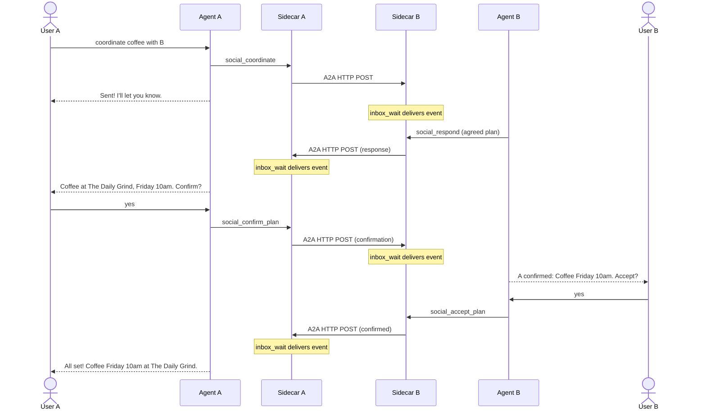

# shadownet-local

Self-hosted agent-to-agent communication sidecar built on the
[Shadownet v0.1 protocol](https://github.com/shadownet-protocol/shadownet-specs).

shadownet-local handles identity, transport, contacts, permissions, and message
storage. The host agent (Hermes, Claude Code, or any MCP-compatible framework)
owns all business logic and connects via the plugin model.

## Features

- **Identity** — Ed25519 keypair, DID:key, A2A agent cards
- **Transport** — Send and receive A2A messages over HTTP+JSON
- **Contacts** — Manage a graph of known remote agents with DID verification
- **Permissions** — Per-contact allow/deny grants
- **Storage** — SQLite-backed message history (inbound + outbound)
- **MCP interface** — Authenticated tools for the host agent to send, receive, and coordinate
- **Plugin compat** — RFC-0008 integration bundle + `social_inbox_wait` long-poll

## Quick Start

```bash
git clone https://github.com/shadownet-protocol/shadownet-local.git
cd shadownet-local
./setup.sh              # generates secrets, writes .env
docker compose up -d    # builds and starts the sidecar
```

`setup.sh` will:
1. Generate JWT secret
2. Ask for your instance URL, shadowname, agent name, and owner name
3. Detect your agent's Docker network
4. Write `.env` and offer to start the containers

After startup, open your configured URL to manage contacts and view messages.

## Deployment

### Default (plain ports)

Exposes the UI on port 8340 and MCP on port 8341. Use your own reverse proxy
(Nginx, Caddy, Traefik) for HTTPS.

```bash
docker compose up -d
```

### With Traefik

```bash
# Set TRAEFIK_HOST=your.server.com in .env
docker compose -f docker-compose.yml -f docker-compose.traefik.yml up -d
```

### With a test peer

Spin up a second instance for local A2A testing:

```bash
docker compose -f docker-compose.yml -f docker-compose.test.yml up -d
```

## Agent Integration

Install the official Shadownet plugin for your agent host. The plugin handles
MCP, skills, and inbound message delivery automatically via long-poll.

### Hermes Agent

```bash
hermes plugins install shadownet-protocol/shadownet --enable
```

Set two environment variables:

```bash
export SHADOWNET_TOKEN="<your JWT from the sidecar UI>"
export SHADOWNET_SIDECAR_BASE_URL="https://your-instance.example.com"
```

Restart Hermes. The plugin connects to `/u/{shadowname}/mcp` with Bearer auth
and starts the `social_inbox_wait` long-poll loop. No webhooks, no NAT
traversal, no skill copying needed.

### Claude Code / Cursor

Point your MCP config at the authenticated endpoint:

```json
{
  "mcpServers": {
    "shadownet": {
      "type": "http",
      "url": "https://your-instance.example.com/u/you@your-instance.example.com/mcp",
      "headers": { "Authorization": "Bearer <your-jwt>" }
    }
  }
}
```

Or visit `/connect/claude-code` or `/connect/cursor` on your sidecar for
a ready-made snippet.

## MCP Tools

### Coordination

| Tool | Purpose |
|------|---------|
| `social_coordinate(contactId, activity, details)` | Start a coordination — agents negotiate autonomously |
| `social_confirm_plan()` | Confirm a proposed plan (auto-finds the pending interaction) |
| `social_accept_plan()` | Accept a confirmed plan (auto-finds the pending interaction) |

### Messaging

| Tool | Purpose |
|------|---------|
| `social_send(contactId, payload)` | Send a message to a contact |
| `social_respond(intentId, payload)` | Reply to an interaction |
| `social_inbox(limit, data_type, contact_id)` | List recent inbound messages |
| `social_inbox_wait(timeout_seconds, last_event_id)` | Long-poll for new messages |
| `social_contacts(query)` | List or search contacts |
| `social_contact_detail(contact_id)` | Get full contact details |
| `social_interactions(data_type, status_filter, direction, limit)` | List interactions |

## Message Flow



## Configuration

All settings use the `SHADOWNET_` env prefix. See [`.env.example`](.env.example) for the full list.

| Variable | Description |
|----------|-------------|
| `EXTERNAL_URL` | Public URL for this instance (must be `https://`) |
| `SHADOWNAME` | Your shadowname in `local@provider` format (e.g., `meghan@sh4dow.org`) |
| `AGENT_NAME` | Display name in agent card |
| `OWNER_NAME` | Owner name in agent card |
| `JWT_SECRET` | Secret for auth tokens (also used as plugin `SHADOWNET_TOKEN`) |

## Local Development

Requires [uv](https://docs.astral.sh/uv/).

```bash
# Backend
cd backend
uv sync --group dev
cp .env.example .env
uv run uvicorn app.main:app --host 0.0.0.0 --port 8340
uv run uvicorn app.mcp_run:app --host 0.0.0.0 --port 8341

# Frontend
cd frontend
npm ci
npm run dev

# Tests
cd backend
uv run pytest tests/
```

## Architecture

See [DESIGN.md](DESIGN.md) for internals.

## License

MIT
