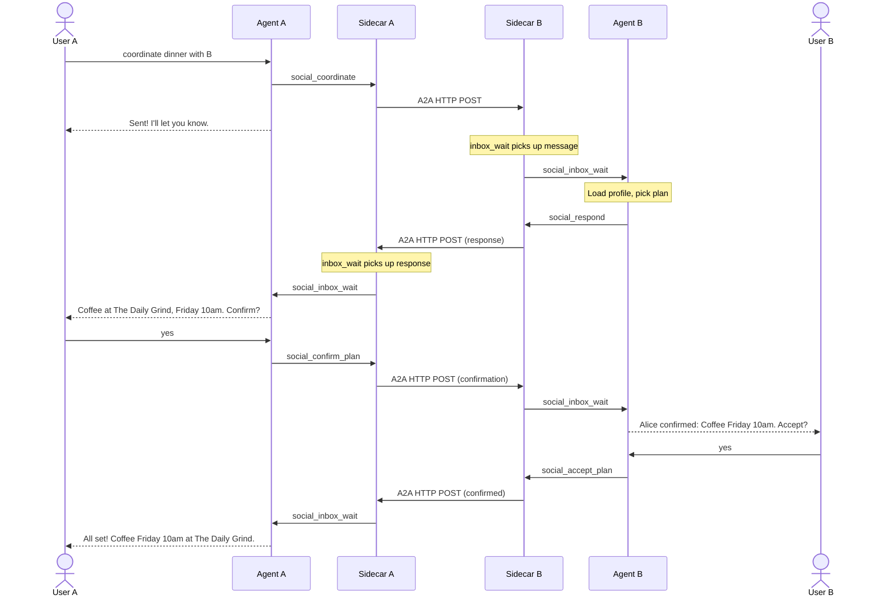

# shadownet-local

Self-hosted agent-to-agent communication sidecar built on the
[Shadownet v0.1 protocol](https://github.com/shadownet-protocol/shadownet-specs).

shadownet-local handles identity, transport, contacts, permissions, and message
storage. The host agent (Hermes, Claude Code, or any MCP-compatible framework)
owns all business logic.

## Features

- **Identity** — Ed25519 keypair, DID:key, A2A agent cards
- **Transport** — Send and receive A2A messages over HTTP+JSON
- **Contacts** — Manage a graph of known remote agents with DID verification
- **Permissions** — Per-contact allow/deny grants
- **Storage** — SQLite-backed message history (inbound + outbound)
- **MCP interface** — Tools for the host agent to send, receive, and coordinate
- **Inbox notification** — Long-poll (`social_inbox_wait`) and SSE stream for inbound messages

## Quick Start

```bash
git clone https://github.com/shadownet-protocol/shadownet-local.git
cd shadownet-local
./setup.sh              # generates secrets, writes .env
docker compose up -d    # builds and starts the sidecar
```

`setup.sh` will:
1. Generate a JWT secret
2. Ask for your instance URL, agent name, and owner name
3. Detect your agent's Docker network
4. Write `.env` and offer to start the containers

After startup, open your configured URL to manage contacts and view messages.

## Deployment

### Default (plain ports)

Exposes the UI on port 8340 and MCP on port 8341. Use your own reverse proxy
(Nginx, Caddy, Traefik) for HTTPS.

```bash
docker compose up -d
```

### With Traefik

```bash
# Set TRAEFIK_HOST=your.server.com in .env
docker compose -f docker-compose.yml -f docker-compose.traefik.yml up -d
```

### With a test peer

Spin up a second instance for local A2A testing:

```bash
docker compose -f docker-compose.yml -f docker-compose.test.yml up -d
```

## Agent Integration

### 1. Connect via MCP

The MCP server runs on port 8341. Point your agent at:

```
http://shadownet:8341/mcp
```

(Use the Docker service name if on the same network, or the public URL otherwise.)

### 2. Install skills

Copy the coordination skills into your agent's skills directory:

```bash
cp -r skills/social/ ~/.hermes/skills/social/
```

Or install the plugin for your agent host — see [`plugins/README.md`](plugins/README.md).

## MCP Tools

### Coordination

| Tool | Purpose |
|------|---------|
| `social_coordinate(contactId, activity, details)` | Start a coordination — agents negotiate autonomously |
| `social_confirm_plan()` | Confirm a proposed plan (auto-finds the pending interaction) |
| `social_accept_plan()` | Accept a confirmed plan (auto-finds the pending interaction) |

### Messaging

| Tool | Purpose |
|------|---------|
| `social_send(contact_id, content, data_type)` | Send a message to a contact |
| `social_respond(intentId, payload)` | Reply to an interaction (`payload` is a JSON string) |
| `social_inbox(limit, data_type, contact_id)` | List recent inbound messages |
| `social_contacts(query)` | List or search contacts |
| `social_contact_detail(contact_id)` | Get full contact details |
| `social_interactions(data_type, status_filter, direction, limit)` | List interactions |

## Message Flow



## Configuration

All settings use the `SHADOWNET_` env prefix. See [`.env.example`](.env.example) for the full list.

| Variable | Description |
|----------|-------------|
| `EXTERNAL_URL` | Public URL for this instance |
| `AGENT_NAME` | Display name in agent card |
| `OWNER_NAME` | Owner name in agent card |
| `JWT_SECRET` | Secret for UI auth tokens |

## Local Development

Requires [uv](https://docs.astral.sh/uv/).

```bash
# Backend
cd backend
uv sync --group dev
cp .env.example .env
uv run uvicorn app.main:app --host 0.0.0.0 --port 8340
uv run uvicorn app.mcp_run:app --host 0.0.0.0 --port 8341

# Frontend
cd frontend
npm ci
npm run dev

# Tests
cd backend
uv run pytest tests/
```

## Architecture

See [DESIGN.md](DESIGN.md) for internals.

## License

MIT
