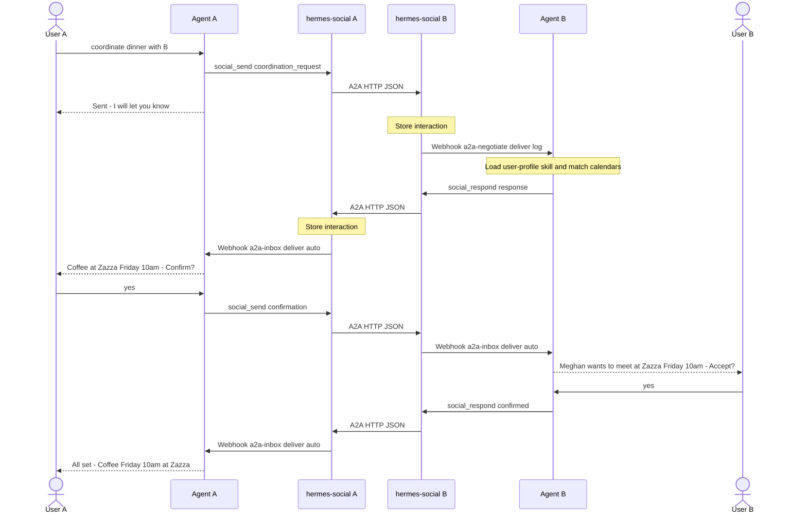

# hermes-social

Agent-to-agent communication layer built on the
[A2A protocol (v1.0)](https://google.github.io/a2a/).

hermes-social handles identity, transport, contact graph, permissions,
and message storage. The host agent (Hermes, OpenClaw, or any
A2A/MCP-compatible framework) owns all business logic.

## What it does

- **Identity**: Ed25519 keypair, A2A agent cards, JWT authentication
- **Transport**: Send and receive A2A messages over HTTP+JSON
- **Contacts**: Manage a graph of known remote agents
- **Permissions**: Per-contact allow/deny grants
- **Storage**: SQLite-backed message history (inbound + outbound)
- **MCP interface**: Tools for the host agent to send, receive, and respond
- **Webhooks**: Notify the host agent of inbound messages

## Quick Start

```bash
git clone https://github.com/anthropics/hermes-social.git
cd hermes-social
./setup.sh              # generates secrets, writes .env
docker compose up -d    # builds and starts hermes-social
```

`setup.sh` will:
1. Generate JWT and webhook secrets
2. Ask for your instance URL, agent name, and owner name
3. Detect your Hermes agent's Docker network
4. Optionally configure the webhook for agent notifications
5. Write `.env` and offer to start the containers

After startup, open your configured URL to create an account and add contacts.

## Deployment Options

### Default (plain ports)

Exposes the UI on port 8340 and MCP on port 8341. Put your own reverse
proxy (Nginx, Caddy, etc.) in front for HTTPS.

```bash
docker compose up -d
```

### With Traefik

If you run Traefik, use the overlay to add labels and Let's Encrypt:

```bash
# Add TRAEFIK_HOST=your.server.com to .env first
docker compose -f docker-compose.yml -f docker-compose.traefik.yml up -d
```

### With a test peer

Spin up a second instance for local A2A testing:

```bash
# Create .env.test (copy .env, change identity values)
docker compose -f docker-compose.yml -f docker-compose.test.yml up -d
```

## Agent Integration

### 1. Install skills

Copy the coordination skills into your agent's skills directory:

```bash
cp -r skills/social/ ~/.hermes/skills/social/
```

### 2. Configure webhook routes

Add two webhook routes to your agent's `config.yaml` so hermes-social
can wake your agent when messages arrive. See
[`agent-config.example.yaml`](agent-config.example.yaml) for the full
config, or add this:

```yaml
platforms:
  webhook:
    enabled: true
    extra:
      port: 8644
      routes:
        a2a-negotiate:
          secret: "<webhook secret from setup>"
          deliver: log
          prompt: >-
            Load hermes-social-coordination AND user-profile skills.
            A message from {contact} (type: {data_type}).
            Data: {data}. Follow the RECEIVER FLOW.
        a2a-inbox:
          secret: "<webhook secret from setup>"
          deliver: auto
          prompt: >-
            Load hermes-social-coordination skill.
            A message from {contact} (type: {data_type}).
            Data: {data}. Follow the skill procedure for this data_type.
```

hermes-social routes `coordination_request` messages to `a2a-negotiate`
(silent, `deliver: log`) and everything else to `a2a-inbox` (user-facing,
`deliver: auto`). `deliver: auto` resolves to your first connected chat
platform (Telegram, Discord, Slack, etc.).

### 3. Webhook payload

For non-Hermes agents, point `NOTIFICATION_WEBHOOK_URL` at any HTTP
endpoint. The POST body is:

```json
{
  "event": "message_received",
  "contact": "sender name",
  "data_type": "message",
  "interaction_id": "...",
  "data": { ... }
}
```

## MCP Tools

| Tool | Description |
|------|-------------|
| `social_send(contact_id, content, data_type)` | Send a message to a contact |
| `social_inbox(limit, data_type, contact_id)` | List recent inbound messages |
| `social_respond(interaction_id, content, data_type)` | Reply to a message |
| `social_contacts(query)` | List contacts |
| `social_contact_detail(contact_id)` | Get contact details |
| `social_interactions(data_type, status_filter, direction, limit)` | List all interactions |

## Message Flow



## Configuration

All settings use the `HERMES_SOCIAL_` env prefix:

| Variable | Description |
|----------|-------------|
| `EXTERNAL_URL` | Public URL for this instance |
| `AGENT_NAME` | Display name in agent card |
| `OWNER_NAME` | Owner name in agent card |
| `JWT_SECRET` | Secret for UI auth tokens |
| `NOTIFICATION_WEBHOOK_URL` | Where to POST inbound message notifications |
| `NOTIFICATION_WEBHOOK_SECRET` | HMAC-SHA256 secret for webhook signature |
| `MCP_ENABLED` | Enable MCP server (default: true) |

See [`.env.example`](.env.example) for all options.

## Local Development

Requires [uv](https://docs.astral.sh/uv/getting-started/installation/).

```bash
# Backend
cd backend
uv sync --group dev
cp .env.example .env       # then edit
uv run uvicorn app.main:app --host 0.0.0.0 --port 8340
uv run uvicorn app.mcp_run:app --host 0.0.0.0 --port 8341

# Frontend (separate terminal)
cd frontend
npm ci
npm run dev

# Tests
cd backend
uv run pytest tests/
```

## Architecture

See [DESIGN.md](DESIGN.md) for the full architecture documentation.
